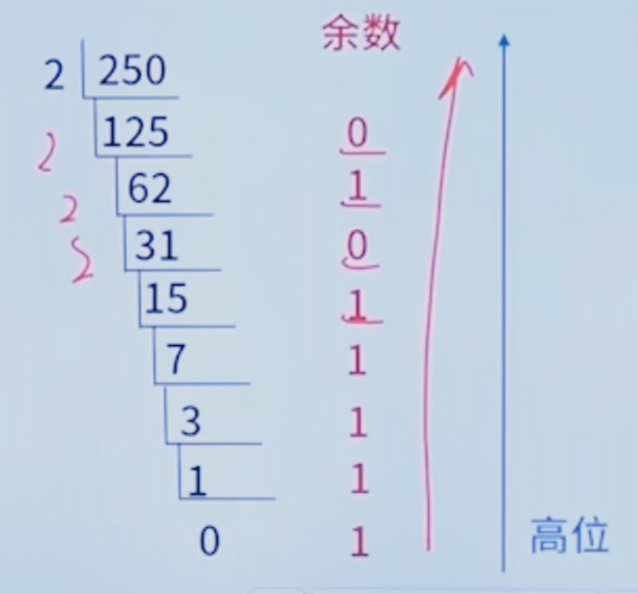

#
## 上下标
- 上标：º ¹ ² ³ ⁴ ⁵ ⁶ ⁷ ⁸ ⁹ ⁺ ⁻ ⁼ ⁽ ⁾ ⁿ ′ ½  ˣ
- 下标：₀ ₁ ₂ ₃ ₄ ₅ ₆ ₇ ₈ ₉ ₊ ₋ ₌ ₍ 
## 计算机硬件基础(4分)
### 数据的表示
#### R进制表示及互转 
- **每一位R进制可以表示R个数值，分别是0~(R-1)**
    | R进制 | 1位可表示的数 | 后缀表示 | 下标表示 |
    | :------ | :------: | :------: | :------: |
    | 二进制(Binary) | 0,1 | (10)B | (10)₂ |
    | 八进制(Octal) | 0,1,2,3,4,5,6,7 | (10)O # | (10)₈ |
    | 十进制(Decimal System) | 0,1,2,3,4,5,6,7,8,9 | (10)D | (10)₁₀ |
    | 十六进制(Hexadecimal) | 0,1,2,3,4,5,6,7,8,9,A,B,C,D,E,F | (10)H | (10)₁₆ |
- **R进制表示原则**：逢R进一（比如十进制从0~9,到9之后从0进一，为10，到19从10进一变为20，到了99之后从10进一100）
  - 二进制：0,1,10,11,100
  - 八进制：0,1,2,3,4,5,6,7,10,11...17,20
  - 十六进制：0,1,2,3,4,5,6,7,8,9,A,B,C,D,E,F,10,11...1F,20
- **R进制转十进制--按权展开**
  - 将二进制整数(111010)₂转换为十进制数
  ```python
    ( 1   1   1   0   1   0 )2
     2⁵   2⁴  2³  2²  2¹  2º    -- 位权
    按位权展开：本位数字与该位数字的位权乘积的代数和即：
    1×2⁵+1×2⁴+1×2³+0×2²+1×2¹+0×2º=32+16+8+2
    =(58)₁₀
  ```
  - 注：其他进制转十进制规则一样
- **十进制整数转二进制**
  - 方法一：熟练掌握2的幂次方的值，套表直接将十进制转换成相应位权值相加，则可知对应位上为1，否则为0
    | 2ˣ | X=7 | X=6 | X=5 | X=4 | X=3 | X=2 | X=1 | X=0 |
    | :------ | :------: | :------: | :------: |:------: |:------: |:------: |:------: |:------: |
    | 位权 | 2⁷ | 2⁶ | 2⁵ | 2⁴ | 2³ | 2² | 2¹ | 2º |
    | 对应数值 | 128 | 64 | 32 | 16 | 8 | 4 | 2 | 1 |
    - 例：将(250)₁₀转换为二进制表示
      ```python
      (250)₁₀=128+64+32+16+8+2=2⁷+2⁶+2⁵+2⁴+2³+2¹
      =1×2⁷+1×2⁶+1×2⁵+1×2⁴+1×2³+0×2²+1×2¹+0×2º
      =(11111010)₂
      ```
  - 方法二：用十进制除2取余法，直到商为0；能除尽为0，不能除尽为1.最后由下往上排列
    - 例：将(250)₁₀转换为二进制表示
        
    - 得到的二进制为(11111010)₂
- **二进制小数转十进制--按权展开**
  - 例：将二进制小数(0.1011)₂转换为十进制数
    ```python
    (   0  .  1    0    1    1   )₂
              2⁻¹  2⁻²  2⁻³  2⁻⁴   -- 位权
    按位权展开：本位数字与该位数字的位权乘积的代数和即：
    1×2⁻¹+0×2⁻²+1×2⁻³+1×2⁻⁴=1/2+1/8+1/16=(11/16)₁₀
    ```
- **十进制分数(或小数)转二进制**
  - 方法一：熟练掌握2的幂次方的值，套表直接将十进制转换为相应的位权值相加，则可知对应位上为1，否则为0。
    | 2ˣ | X=-1 | X=-2 | X=-3 | X=-4 | X=-5 | X=-6 | X=-7 |
    | :------ | :------: | :------: | :------: |:------: |:------: |:------: |:------: |
    | 位权 | 2⁻¹ | 2⁻² | 2⁻³ | 2⁻⁴ | 2⁻⁵ | 2⁻⁶ | 2⁻⁷ |
    | 对应数值 | 1/2 | 1/4 | 1/8 | 1/16 | 1/32 | 1/64 | 1/128 |
    - 例：将十进制小数(0.6875)₁₀转换为二进制数
        ```python
        (0.6875)₁₀=0.5+0.125+0.0625=1/2+1/8+1/16=1×2⁻¹+1×2⁻³+1×2⁻⁴
        =(0.1011)₂
        ```

#### 原码、反码和补码
#### 逻辑运算

### 计算机体系结构
#### 冯·诺依曼体系结构
#### 计算机总线

### 指令系统基础
#### 寻址方式
#### 指令系统类型
#### Flynn分类
#### 流水线技术

### 存储系统
#### 多级存储结构
#### 主存
#### Cache
#### 硬盘
#### 存储系统的存取方式

### 系统可靠性
#### 可靠性指标
#### 可靠性计算
