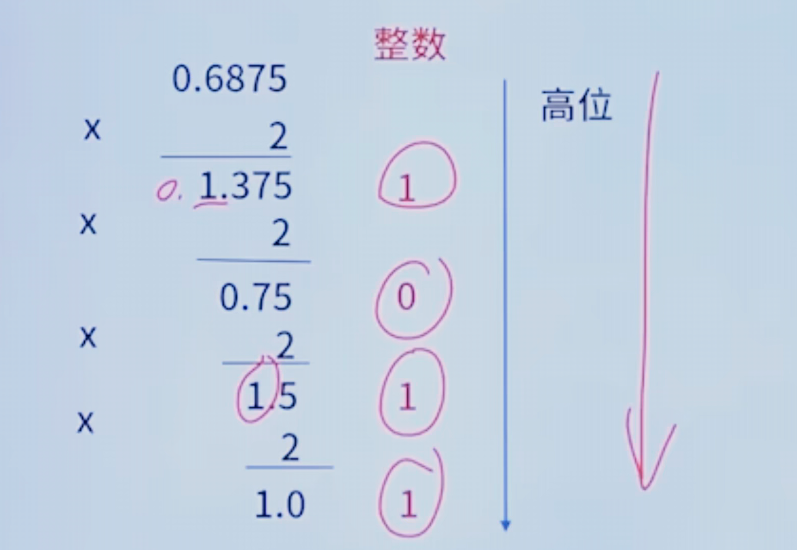

#
## 上下标
- 上标：º ¹ ² ³ ⁴ ⁵ ⁶ ⁷ ⁸ ⁹ ⁺ ⁻ ⁼ ⁽ ⁾ ⁿ ′ ½  ˣ
- 下标：₀ ₁ ₂ ₃ ₄ ₅ ₆ ₇ ₈ ₉ ₊ ₋ ₌ ₍ 
## 计算机硬件基础(4分)
### 数据的表示
#### R进制表示及互转 
- **每一位R进制可以表示R个数值，分别是0~(R-1)**
    | R进制 | 1位可表示的数 | 后缀表示 | 下标表示 |
    | :------ | :------: | :------: | :------: |
    | 二进制(Binary) | 0,1 | (10)B | (10)₂ |
    | 八进制(Octal) | 0,1,2,3,4,5,6,7 | (10)O # | (10)₈ |
    | 十进制(Decimal System) | 0,1,2,3,4,5,6,7,8,9 | (10)D | (10)₁₀ |
    | 十六进制(Hexadecimal) | 0,1,2,3,4,5,6,7,8,9,A,B,C,D,E,F | (10)H | (10)₁₆ |
- **R进制表示原则**：逢R进一（比如十进制从0~9,到9之后从0进一，为10，到19从10进一变为20，到了99之后从10进一100）
  - 二进制：0,1,10,11,100
  - 八进制：0,1,2,3,4,5,6,7,10,11...17,20
  - 十六进制：0,1,2,3,4,5,6,7,8,9,A,B,C,D,E,F,10,11...1F,20
- **R进制转十进制--按权展开**
  - 将二进制整数(111010)₂转换为十进制数
  ```python
    ( 1   1   1   0   1   0 )2
     2⁵   2⁴  2³  2²  2¹  2º    -- 位权
    按位权展开：本位数字与该位数字的位权乘积的代数和即：
    1×2⁵+1×2⁴+1×2³+0×2²+1×2¹+0×2º=32+16+8+2
    =(58)₁₀
  ```
  - 注：其他进制转十进制规则一样
- **十进制整数转二进制**
  - 方法一：熟练掌握2的幂次方的值，套表直接将十进制转换成相应位权值相加，则可知对应位上为1，否则为0
    | 2ˣ | X=7 | X=6 | X=5 | X=4 | X=3 | X=2 | X=1 | X=0 |
    | :------ | :------: | :------: | :------: |:------: |:------: |:------: |:------: |:------: |
    | 位权 | 2⁷ | 2⁶ | 2⁵ | 2⁴ | 2³ | 2² | 2¹ | 2º |
    | 对应数值 | 128 | 64 | 32 | 16 | 8 | 4 | 2 | 1 |
    - 例：将(250)₁₀转换为二进制表示
      ```python
      (250)₁₀=128+64+32+16+8+2=2⁷+2⁶+2⁵+2⁴+2³+2¹
      =1×2⁷+1×2⁶+1×2⁵+1×2⁴+1×2³+0×2²+1×2¹+0×2º
      =(11111010)₂
      ```
  - 方法二：用十进制除2取余法，直到商为0；能除尽为0，不能除尽为1.最后由下往上排列
    - 例：将(250)₁₀转换为二进制表示
        
    - 得到的二进制为(11111010)₂
- **二进制小数转十进制--按权展开**
  - 例：将二进制小数(0.1011)₂转换为十进制数
    ```python
    (   0  .  1    0    1    1   )₂
              2⁻¹  2⁻²  2⁻³  2⁻⁴   -- 位权
    按位权展开：本位数字与该位数字的位权乘积的代数和即：
    1×2⁻¹+0×2⁻²+1×2⁻³+1×2⁻⁴=1/2+1/8+1/16=(11/16)₁₀
    ```
- **十进制分数(或小数)转二进制**
  - 方法一：熟练掌握2的幂次方的值，套表直接将十进制转换为相应的位权值相加，则可知对应位上为1，否则为0。
    | 2ˣ | X=-1 | X=-2 | X=-3 | X=-4 | X=-5 | X=-6 | X=-7 |
    | :------ | :------: | :------: | :------: |:------: |:------: |:------: |:------: |
    | 位权 | 2⁻¹ | 2⁻² | 2⁻³ | 2⁻⁴ | 2⁻⁵ | 2⁻⁶ | 2⁻⁷ |
    | 对应数值 | 1/2 | 1/4 | 1/8 | 1/16 | 1/32 | 1/64 | 1/128 |
    - 例：将十进制小数(0.6875)₁₀转换为二进制数
        ```python
        (0.6875)₁₀=0.5+0.125+0.0625=1/2+1/8+1/16=1×2⁻¹+1×2⁻³+1×2⁻⁴
        =(0.1011)₂
        ```
  - 方法二：用十进制小数部分乘2取整
    - 例：将十进制小数(0.6875)₁₀转换为二进制数
      
      - 得到转换的二进制为：(0.1011)₂
- **整数二进制转八进制**
  - 从右往左每3位二进制转一位八进制，不足3位的在最左边添0补齐；反之八转二，则每1位八进制转换为3位二进制表示。
  - 例：(100 011 110)₂  --  (436)₈
- **整数二进制转十六进制**
  - 从右往左每4位二进制转一位十六进制，不足4位的在最左边添0补齐；反之十六转二，则每1位十六进制转换为4位二进制表示。
  - 例：(1 0001 1110)₂  --  (11E)₁₆
- **小数二进制转八进制**
  - 从小数点开始往右每3位二进制转1位八进制，不足3位的在最右边添0补齐；反之八转二，则每1位八进制转换为3位二进制表示。
  - 例：(0.100 011 110)₂  --  (0.436)₈
- **小数二进制转十六进制**
  - 从小数点开始往右每4位二进制转1位十六进制，不足4位的在最右边添0补齐；反之十六转二，则每1位十六进制转换为4位二进制表示。
    - 例：(0.1000 1111 0)₂  --  (0.8F0)₁₆

#### 原码、反码和补码
- **相关说明**：计算机只识别和处理二进制，而对于数据又分为有符号数据和无符号数据：
  - 有符号数据是指有正负之分的数据（如-10或+8）
  - 无符号数据是没有正负之分的，如ASCII字符
  - 而原码，反码、补码是计算机存储有符号数据的编码方式
  - 在计算机中用一个数的最高位表示符号位，正数为0，负数为1
- **原码、反码和补码的定义**
    |  | 正数 | 负数 |
    | :------ | :------: | :------: | 
    | 原码 | 最高位添加符号位0 | 最高位添加符号位1 |
    | 反码 | 与原码相同 | 保持其原码符号位不变，数值位按位取反(即原码中为0，则取1，为1则取0) |
    | 补码 | 与原码相同 | 先保持其原码符号位不变，数值位按位取反，然后再加1 |
- 例：用8位二进制表示整数1和负数1，并将其相加求结果
  |  | +1 | -1 | 1+（-1）| +0/-0 |
  | :------ | :------: | :------: |  :------: | :------: |
  | 原码 | 0 0000001 | 1 0000001  | 1 0000010  | +0(00000000)<br>-0(10000000)|
  | 反码 | 0 0000001 | 1 1111110  | 1 1111111  | +0(00000000)<br>-0(1111111)|
  | 补码 | 0 0000001 | 1 1111111  | 0 0000000  | 00000000|
  - 原码的1+(-1)为-2，不为0，且0有两种表示方法
  - 反码的0有两种表示方法
- **结论**
  - 补码的符号位可以和数值为一起参与运算，结果不出错；
  - **补码的0表示唯一，另外移码的0表示也唯一（与补码只是符号位相反，其余一样）**
  - **在计算机中均采用补码表示**
  - **反码、补码、移码表示的实际值都需要转换成原码去查看**
- **原码、反码及补码的取值范围**
  - n位二进制的原码、反码及补码的取值范围如下：
    |  | 定点整数 | 定点小数(粗略范围) | 定点小数(精确范围)|
    | :------ | :------: | :------: |  :------: |
    | 原码 | -(2ⁿ⁻¹-1) ~ 2ⁿ⁻¹-1  | -1<X<1 | -(1-2⁻⁽ⁿ⁻¹⁾)  ~ 1-2⁻⁽ⁿ⁻¹⁾ | 
    | 反码 | -(2ⁿ⁻¹-1) ~ 2ⁿ⁻¹-1  | -1<X<1 | -(1-2⁻⁽ⁿ⁻¹⁾)  ~ 1-2⁻⁽ⁿ⁻¹⁾ | 
    | 补码 | -2ⁿ⁻¹ ~ 2ⁿ⁻¹-1  | -1≤X<1 | -1 ~ 1-2⁻⁽ⁿ⁻¹⁾ | 
    - 如8位补码定点整数范围：-128 ~ +127
- **原码、反码及补码的取值个数**
  |  | 定点个数 |
  | :------ | :------: |
  | 原码 | 2ⁿ⁻¹ |
  | 反码 | 2ⁿ⁻¹ |
  | 补码 | 2ⁿ |
  - 取值个数：最大值-最小值+1
    - 如8位补码取值个数为256

#### 逻辑运算

### 计算机体系结构
#### 冯·诺依曼体系结构
#### 计算机总线

### 指令系统基础
#### 寻址方式
#### 指令系统类型
#### Flynn分类
#### 流水线技术

### 存储系统
#### 多级存储结构
#### 主存
#### Cache
#### 硬盘
#### 存储系统的存取方式

### 系统可靠性
#### 可靠性指标
#### 可靠性计算
